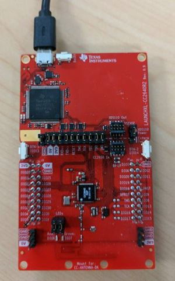

# BIM OAD Off-Chip

## Table of Contents

* [Introduction](#Introduction)
* [Hardware Prerequisites](#Hardware Prerequisites)
* [Software Prerequisites](#Software Prerequisites)
* [Usage](#Usage)

## Introduction

The bim\_oad\_offchip is a small project used with the
simple\_peripheral project in OAD off-chip configuration; it is not used as a
standalone project. It is a lightweight Boot Image Manager (BIM)
that resides in the last page of internal flash and executes after the boot ROM.
BIM for off-chip OAD is used to determine whether to run the existing application
image or to copy a new image or images from off-chip flash to on-chip flash.
Use the cc2640r2lp\_app-FlashROM\_OAD\_Offchip configuration
of the simple\_peripheral application. See the [**OAD section of the BLE5-Stack User's Guide**](http://software-dl.ti.com/lprf/ble5stack-docs-latest/docs/ble5stack/ble_user_guide/html/oad/oad.html)
for more information.

## Hardware Prerequisites

The default BIM OAD Off-chip configuration uses the
[LAUNCHXL-CC2640R2](http://www.ti.com/tool/launchxl-cc2640r2). This hardware
configuration is shown in the below image:

For custom hardware, see the [**Running the SDK on Custom Boards section of the
BLE5-Stack User's Guide**](http://software-dl.ti.com/lprf/ble5stack-docs-latest/docs/ble5stack/ble_user_guide/html/ble-stack/index.html#running-the-sdk-on-custom-boards).

## Software Prerequisites

For information on what versions of Code Composer Studio and IAR Embedded
Workbench to use, see the Release Notes located in the
docs/ble5stack folder. For
information on how to import this project into your IDE workspace and
build/run, please refer to [**The CC2640R2F Platform section in the BLE5-Stack User's Guide**](http://software-dl.ti.com/lprf/ble5stack-docs-latest/docs/ble5stack/ble_user_guide/html/cc2640/platform.html).

## Usage

The usage of this project is explained in the
[**OAD section of the BLE5-Stack User's Guide**](http://software-dl.ti.com/lprf/ble5stack-docs-latest/docs/ble5stack/ble_user_guide/html/oad/oad.html).

By default, this project uses the following pins to access the SPI flash:

PIN             | CC2640R2F Pins
----------------|----------------
IOID_FLASH_CS   | IOID_20
SPI_MOSI        | IOID_9
SPI_MISO        | IOID_8
SPI_CLK_FLASH   | IOID_10

These can be changed using the procedure described in the
[**OAD Off-Chip section of the BLE5-Stack User's Guide**](http://software-dl.ti.com/lprf/ble5stack-docs-latest/docs/ble5stack/ble_user_guide/html/oad/oad.html)add-off-chip-oad-to-an-existing-project).
