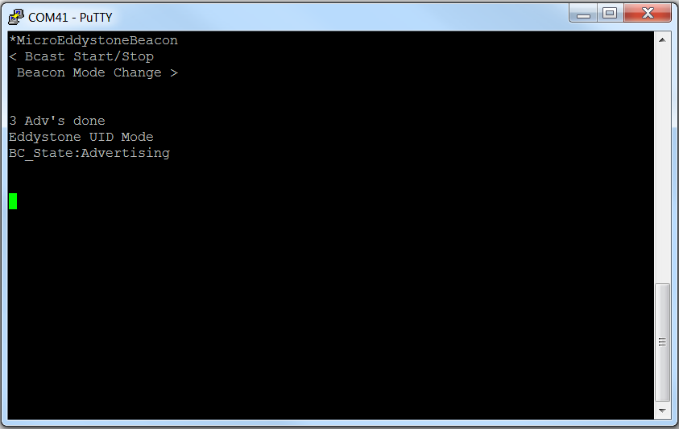
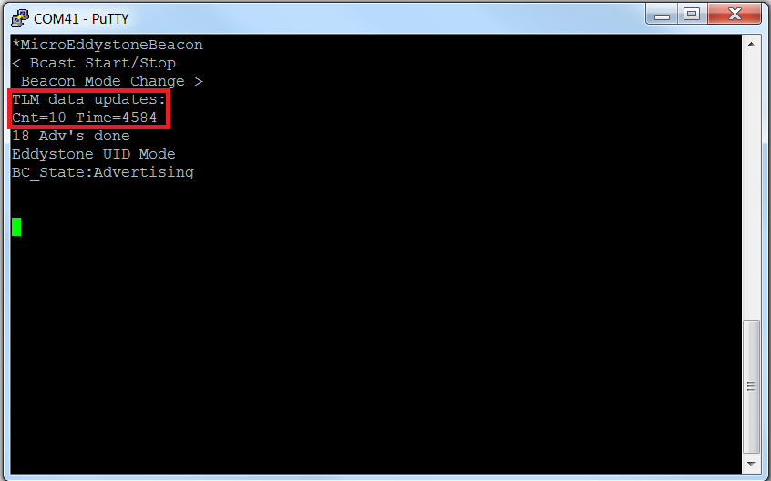
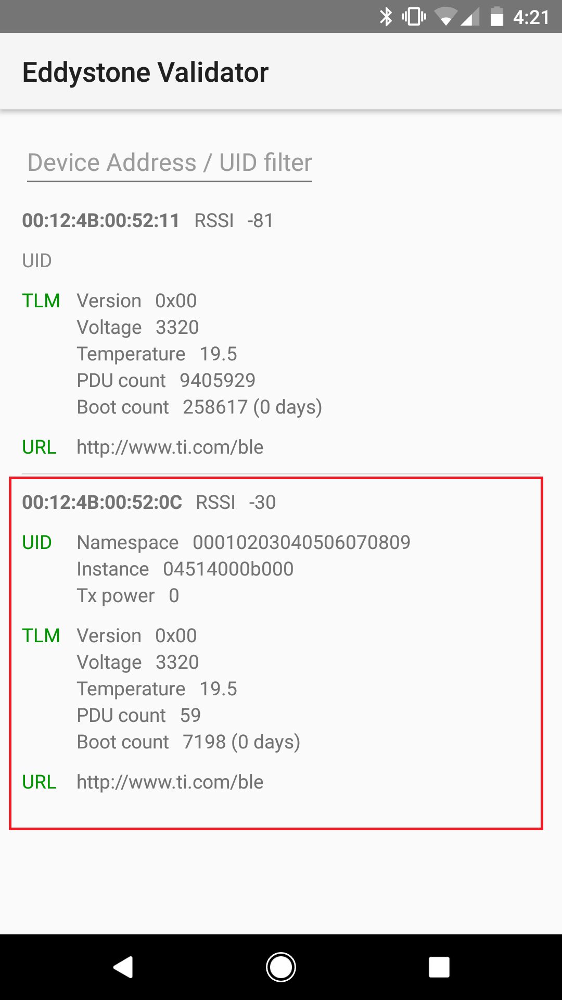

# Micro Eddystone Beacon

## Table of Contents

* [Introduction](#Introduction)
* [Hardware Prerequisites](#Hardware Prerequisites)
* [Software Prerequisites](#Software Prerequisites)
* [Usage](#Usage)

## Introduction

The micro\_eddystone\_beacon project uses a unique Micro BLE Stack that
has been optimized/reduced to only support the broadcast role to save
memory. This project will demonstrate the implementation of a
non-connectable beacon that uses the Eddystone beacon format.
Background and introduction to Bluetooth low energy beacons can be found
here: [SWRA475](http://www.ti.com/lit/pdf/swra475). The specifications
and instructions on using the simple\_eddystone project in particular
can be found here: [SWRA491](http://www.ti.com/lit/pdf/swra491). See
the [**Micro BLE Stack section of the BLE5-Stack User's Guide**](http://software-dl.ti.com/lprf/ble5stack-docs-latest/docs/ble5stack/ble_user_guide/html/u-stack/index.html)
for more details.

## Hardware Prerequisites

The default Micro Eddystone Beacon configuration uses the
[LAUNCHXL-CC2640R2](http://www.ti.com/tool/launchxl-cc2640r2). This hardware
configuration is shown in the below image:

For custom hardware, see the [**Running the SDK on Custom Boards section of the
BLE5-Stack User's Guide**](http://software-dl.ti.com/lprf/ble5stack-docs-latest/docs/ble5stack/ble_user_guide/html/ble-stack/index.html#running-the-sdk-on-custom-boards).

## Software Prerequisites

For information on what versions of Code Composer Studio and IAR Embedded
Workbench to use, see the Release Notes located in the
docs/ble5stack folder. For
information on how to import this project into your IDE workspace and
build/run, please refer to [**The CC2640R2F Platform section in the BLE5-Stack User's Guide**](http://software-dl.ti.com/lprf/ble5stack-docs-latest/docs/ble5stack/ble_user_guide/html/cc2640/platform.html).

## Usage

This application uses the UART peripheral to provide an interface for the
application. This document will use PuTTY to serve as the display for the output
of the CC2640R2 LaunchPad. Note that any other serial terminal can be used. The
following default parameters are used for the UART peripheral for display:

  UART Param     |Default Values
  -------------- |----------------
  Baud Rate      |115200
  Data length    |8 bits
  Parity         |None
  Stop bits      |1 bit
  Flow Control   |None

Once the application starts, it will immediately start broadcasting UID
advertising packets. The output to the terminal window will show the Eddystone
mode type (UID or URL), the broadcasting state (Idle or Advertising), and how
many advertisements have been broadcasted:

Pressing the left button (BTN-1 on the CC2640R2 LaunchPad) will toggle
advertising on/off. Pressing the right button (BTN-2) will toggle between UID
and URL advertisements. Regardless of which type of Eddystone mode the device is
in, every 10th packet will be a TLM packet. The TLM data will be displayed
starting with the first TLM packet that is sent, and this will be updated with
every new TLM packet:

The Eddystone Validator app discussed in the Eddystone document (introduced in
the Introduction section above) can be used to verify these advertising packets:

Note that, unlike the beacons mentioned in the Eddystone document, the beacon
advertisements produced with this application are all non-connectable (including
the URL packets).
