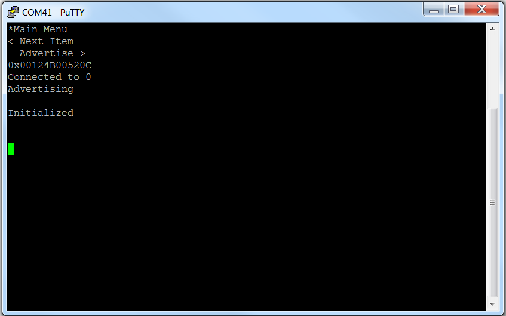
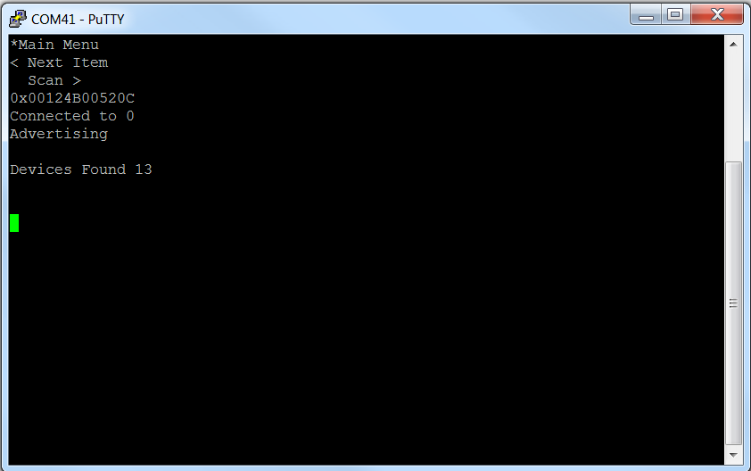
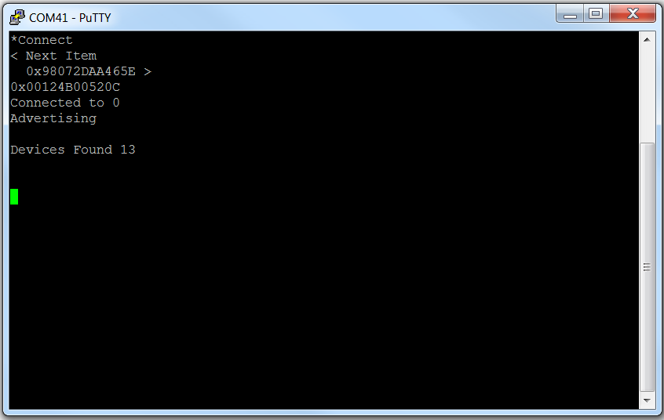
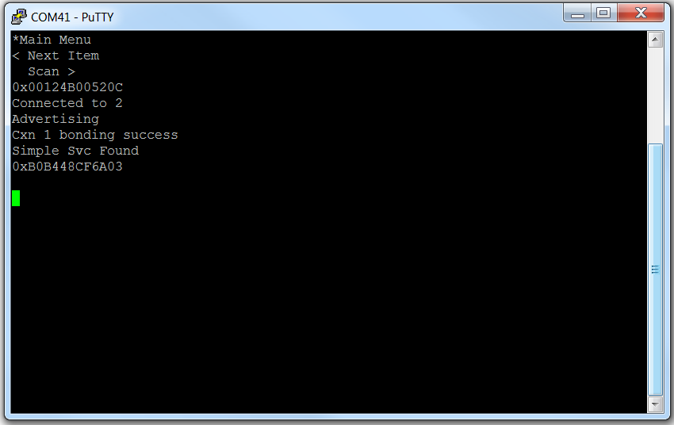
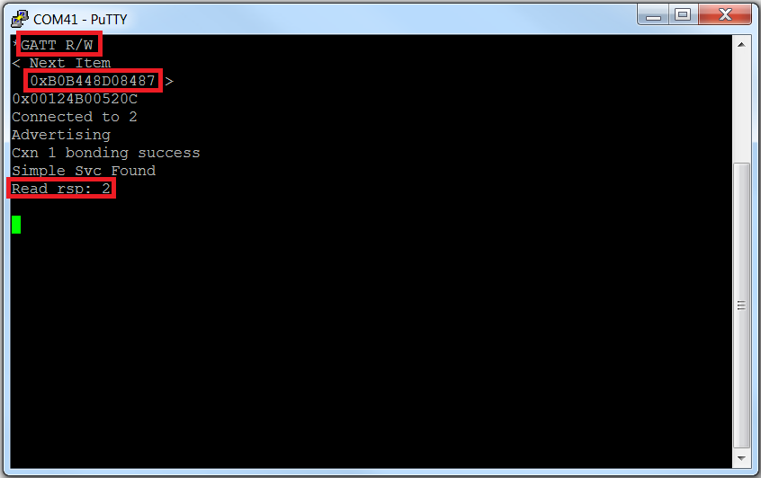
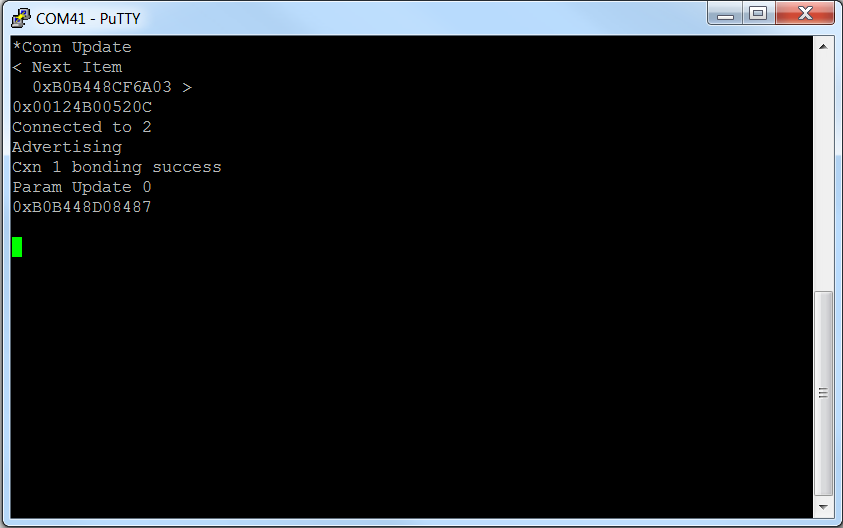
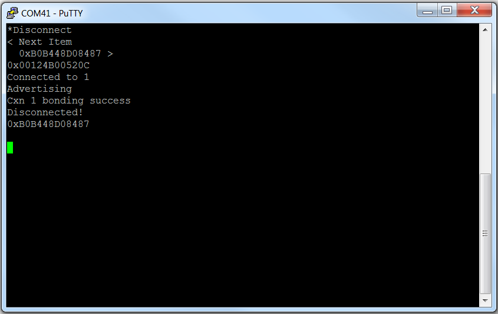

# Multi Role

* [Introduction](#Introduction)
* [Hardware Prerequisites](#Hardware Prerequisites)
* [Software Prerequisites](#Software Prerequisites)
* [Assumptions/Considerations](#Assumptions/Considerations)
* [Usage](#Usage)
    * [Advertise](#Advertise)
    * [Scan](#Scan)
    * [Connect](#Connect)
    * [GATT Read/Write](#GATT Read/Write)
    * [Connection Update](#Connection Update)
    * [Disconnect](#Disconnect)

## <a name="Introduction"></a>Introduction

This project demonstrates the capabilities of the
Texas Instruments BLE stack to function in multiple simultaneous
connection roles. Specifically, the project is capable of functioning as
a master and a slave simultaneously, in any combination, while
maintaining up to 4 connections in the "Cache-as-RAM" build configuration.
The project is capable of connecting to any central/peripheral device. Any type
of legacy pairing/bonding is possible. Parameter updates are supported.
Connections can be established in any role. The project supports multiple
simultaneous GATT discoveries and/or pairings/bondings.

## <a name="Hardware Prerequisites"></a>Hardware Prerequisites

The default Multi Role configuration uses the
[LAUNCHXL-CC2640R2](http://www.ti.com/tool/launchxl-cc2640r2). This hardware
configuration is shown in the below image:


For custom hardware, see the [**Running the SDK on Custom Boards section of the
BLE5-Stack User's Guide**](http://software-dl.ti.com/lprf/ble5stack-docs-latest/docs/ble5stack/ble_user_guide/html/ble-stack/index.html#running-the-sdk-on-custom-boards).

## <a name="Software Prerequisites"></a>Software Prerequisites

For information on what versions of Code Composer Studio and IAR Embedded
Workbench to use, see the Release Notes located in the
docs/ble5stack folder. For
information on how to import this project into your IDE workspace and
build/run, please refer to [**The CC2640R2F Platform section in the BLE5-Stack User's Guide**](http://software-dl.ti.com/lprf/ble5stack-docs-latest/docs/ble5stack/ble_user_guide/html/cc2640/platform.html).

## <a name="Assumptions/Considerations"></a>Assumptions/Considerations

In this document, the terms master/central and slave/peripheral are used
synonymously. It is assumed that the master/central devices are GATT clients and
slave/peripheral devices are GATT servers. Once the connection limit (set with
the MAX_NUM_BLE_CONNS preprocessor define) is reached, the multi_role device
won’t be allowed to advertise/scan until there is a disconnection.

When connected in the master role, the multi_role device will query the slave
device for the simpleGATTProfile service in order to demo some basic GATT
procedures (read/write characteristic). However, it is not necessary for the
slave device to contain this service in order for a connection to be
established. That is, it is possible for the peripheral devices in the system to
have differing attribute tables since the multi_role device will perform a
service/characteristic discovery after each connection is formed.

Due to the large amount of functionality in this project, it is rather
RAM-constrained. If the project is configured for too many connections (via the
MAX_NUM_BLE_CONNS preprocessor define) and also security, it is possible for
heap allocation failures to occur which will break the stack. Therefore, the
project should be stress-tested for its intended use case to verify that there
are no heap issues by including the HEAPMGR_METRICS preprocessor define. See the
[**Debugging section of the BLE5-Stack User's Guide**](http://software-dl.ti.com/lprf/ble5stack-docs-latest/docs/ble5stack/ble_user_guide/html/debugging/ble-index.html)
for more information on how to do this.

In order to provide more RAM to allow for more connections/security, there is
an additional project configuration for both the IAR and CCS projects to use the
cache as RAM. See the
[**Using the Cache as RAM section of the BLE5-Stack User's Guide**](http://software-dl.ti.com/lprf/ble5stack-docs-latest/docs/ble5stack/ble_user_guide/html/cc2640/memory_management.html#using-the-cache-as-ram).
Of course, using the cache as RAM comes at the tradeoff of
potential increased processing time and thus higher power consumption.

When at least one connection is already formed, in order to allow enough
processing time to scan for a new connection, the minimum possible connection
interval (in milliseconds) that can be used is:

```12.5 + 5*n```

where n is the amount of current connections. For example, if there are
currently four connections, all four connections must use a minimum connection
interval of ```12*5 + 5*4 = 32.5 ms``` in order to allow scanning to occur to
establish a new connection.

## <a name="Usage"></a>Usage

The multi\_role project uses the two buttons on the CC2640R2 LaunchPad to accept
user input and outputs information through the UART. This document will use
PuTTY to serve as the display for the output of the CC2640R2 LaunchPad. Note that
any other serial terminal can be used. The following default parameters are used
for the UART peripheral for display:

  UART Param     |Default Values
  -------------- |----------------
  Baud Rate      |115200
  Data length    |8 bits
  Parity         |None
  Stop bits      |1 bit
  Flow Control   |None

Upon powering on or resetting the device, the user will see the main
menu. When in the main menu, the left button will scroll through the
possible actions, which are:

* Scan
* Advertise

Other options will become available once devices are scanned, and again once a
connection is formed.

The device will report upon startup that it is initialized, advertising, and
connected to 0 devices:



The right button is used to select one of the available options. Each option
will be covered in the following sections.

### <a name="Advertise"></a>Advertise

Selecting this option will toggle advertising on and off. When advertising is
off, it will display "Ready to Advertise". This device will send out connectable
advertisements.

### <a name="Scan"></a>Scan

Selecting this option will start a device discovery to search for advertising
devices. It will then display the number of devices found:



### <a name="Connect"></a>Connect

The option to connect to a device will now become available (note that options
other than scan and advertise will be preceded with a "+"). Selecting this
option will bring you to the "Connect" menu, where you can scroll through the
discovered devices:




A device can then be selected to initiate a connection. The connect option can
be chosen again to connect with additional peripheral devices. The terminal
window will display the number of devices that are connected to the Multi Role
device:



At this point, all menu options are present. The following options can be
chosen:

* Scan
* Advertise
* Connect
* GATT Read/Write
* Connection Update
* Disconnect

### <a name="GATT Read/Write"></a>GATT Read/Write

Pressing the right button from the main menu while "GATT Read/Write"
is shown will enter the "GATT Read/Write" menu. Here, the left button
is used to browse through connected devices. When a device is selected
with the right button, a GATT read/write of simple profile
characteristic 1 will be sent to the connected device. Each time a
device is chosen, the action toggles between read and write with the
write value incrementing by 1. It is also possible to browse to and
select "Upper Menu" to return to the main menu.



### <a name="Connection Update"></a>Connection Update

Pressing the right button from the main menu while "Connection Update"
is shown will enter the "Connection Update" menu. Here, the left button
is used to browse through connected devices. When a device is selected
with the right button, a connection parameter update is sent to the
connected device with the following parameters:

* 100 ms minimum connection interval
* 187.5 ms maximum connection interval
* 0 slave latency
* 2 seconds supervision timeout



It is also possible to browse to and select "Upper Menu" to return to the
main menu.

### <a name="Disconnect"></a>Disconnect

Pressing the right button from the main menu while "Disconnect" is shown
will enter the "Disconnect" menu. Here, the left button is used to
browse through connected devices. When a device is selected with the
right button, a link termination request will be sent to the connected
device:



 It is also possible to browse to and select "Upper Menu" to return to
the main menu.
