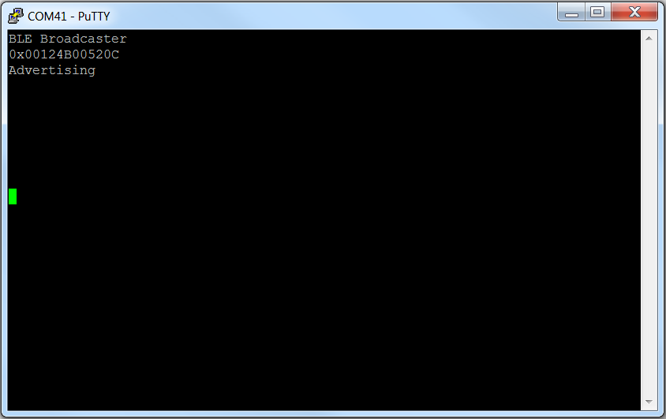
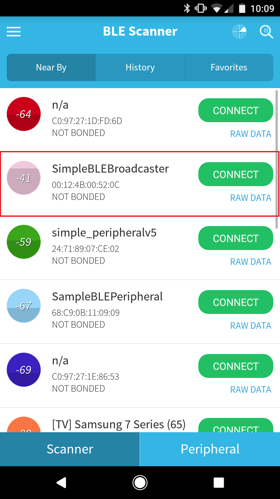
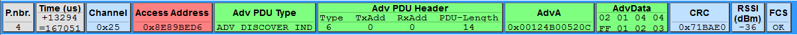

# Simple Broadcaster

## Table of Contents

* [Introduction](#Introduction)
* [Hardware Prerequisites](#Hardware Prerequisites)
* [Software Prerequisites](#Software Prerequisites)
* [Usage](#Usage)

## Introduction

The simple\_broadcaster project demonstrates non-connectable
beacon applications, such as Apple iBeacon™ and Google Eddystone™. See
Bluetooth low energy Beacons Application Note
([SWRA475](http://www.ti.com/lit/pdf/swra475)) for more information
about Bluetooth low energy beacons.

This document discusses the procedure for using the Simple Peripheral
application when the FlashROM_StackLibrary configuration is used.
The FlashROM_StackLibrary_RCOSC configuration is discussed in the
[**RCOSC section of the BLE5-Stack User's Guide**](http://software-dl.ti.com/lprf/ble5stack-docs-latest/docs/ble5stack/ble_user_guide/html/ble-stack/custom-hardware.html#using-32-khz-crystal-less-mode).

## Hardware Prerequisites

The default Simple Broadcaster configuration uses the
[LAUNCHXL-CC2640R2](http://www.ti.com/tool/launchxl-cc2640r2). This hardware
configuration is shown in the below image:

For custom hardware, see the [**Running the SDK on Custom Boards section of the
BLE5-Stack User's Guide**](http://software-dl.ti.com/lprf/ble5stack-docs-latest/docs/ble5stack/ble_user_guide/html/ble-stack/index.html#running-the-sdk-on-custom-boards).

## Software Prerequisites

For information on what versions of Code Composer Studio and IAR Embedded
Workbench to use, see the Release Notes located in the
docs/ble5stack folder. For
information on how to import this project into your IDE workspace and
build/run, please refer to [**The CC2640R2F Platform section in the BLE5-Stack User's Guide**](http://software-dl.ti.com/lprf/ble5stack-docs-latest/docs/ble5stack/ble_user_guide/html/cc2640/platform.html).

## Usage

This application uses the UART peripheral to display messages. The UART is only
used to display messages.

This application is configured to broadcast sample advertising data out of the
box. It sends non-connectable advertisements.

This document will use PuTTY to serve as the display for the output of the
CC2640R2 LaunchPad, and it will use BLE Scanner as the phone app that will scan
the device to show that it is advertising. Note that any other serial terminal
and smart phone BLE application can be used. The following default parameters
are used for the UART peripheral for display:

  UART Param     |Default Values
  -------------- |----------------
  Baud Rate      |115200
  Data length    |8 bits
  Parity         |None
  Stop bits      |1 bit
  Flow Control   |None

Once the Simple Broadcaster sample application starts, the output to the terminal
will report its address and the fact that it is advertising, as shown below:

Advertising is enabled by default upon startup, so there is no need to
physically press a button to start advertising. Using BLE Scanner to scan for the
device, you should see a device with the name of SimpleBLEBroadcaster (note that
the navigation might be slightly different depending on your mobile
application):

If there is more than 1 device called SimpleBLEBroadcaster, the RSSI value in
the colored circles on the left can be used to find which device you are looking
for. The device name is being sent from the Simple Broadcaster device in the
scan response data that is sent when the device is scanned by BLE Scanner. The
Simple Broadcaster device is sending out non-connectable advertisements, so it
cannot be connected to by the smartphone application (or any other central
device). Pressing "connect" in BLE Scanner will not do anything.

TI's [**SmartRF Protocol Packet Sniffer**](http://www.ti.com/tool/packet-sniffer)
can be used to see the advertising data that is being broadcasted:

The information in the "AdvData" field shows the advertising data that is being
broadcasted. This data can be changed by making changes to advertData in
simple_broadcaster.c. Also, note that defining BEACON_FEATURE in the project
will change the data that is being advertised.

The information in the "AdvA" field shows the address of the Simple Broadcaster
device. This will match what was shown in BLE Scanner.

The information in the "Adv PDU Type" shows that the advertisements are
discoverable and non-connectable.
