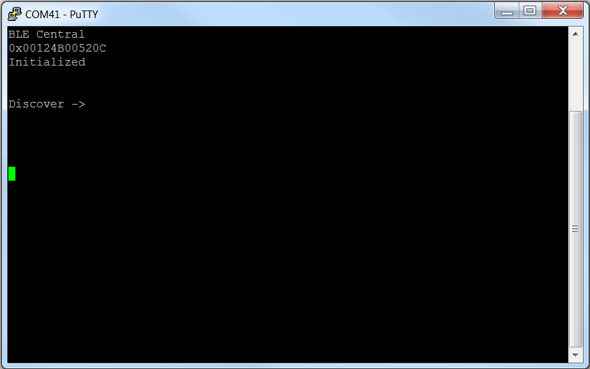
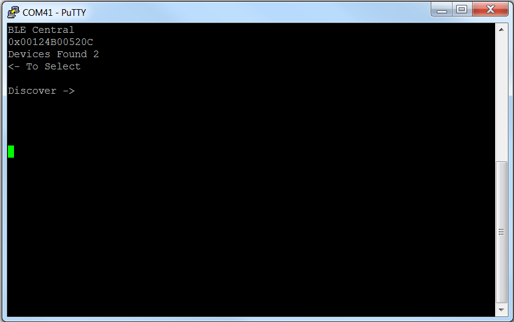
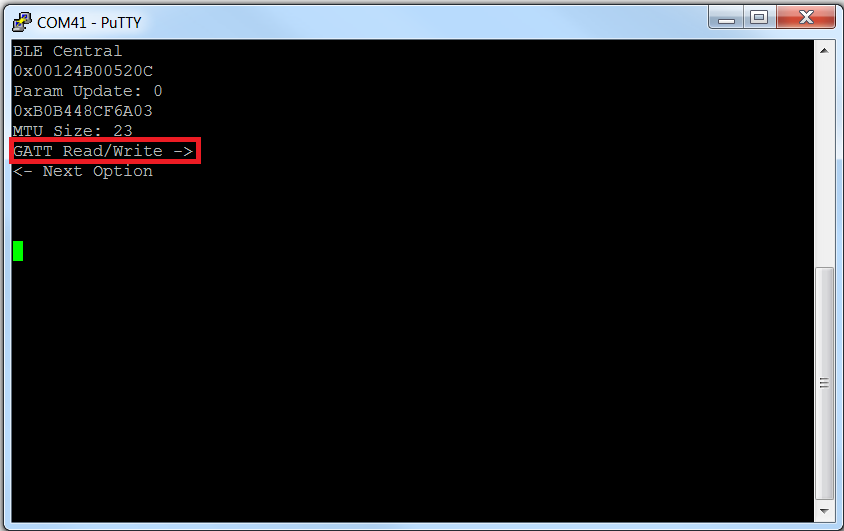
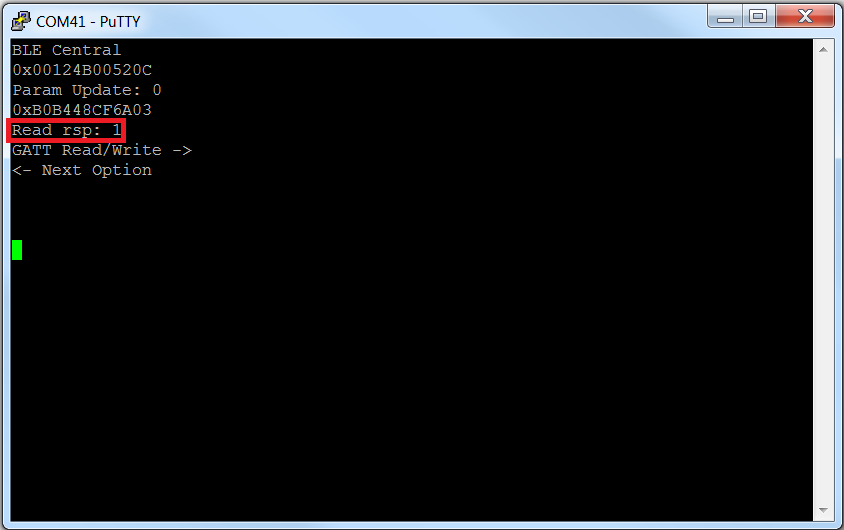
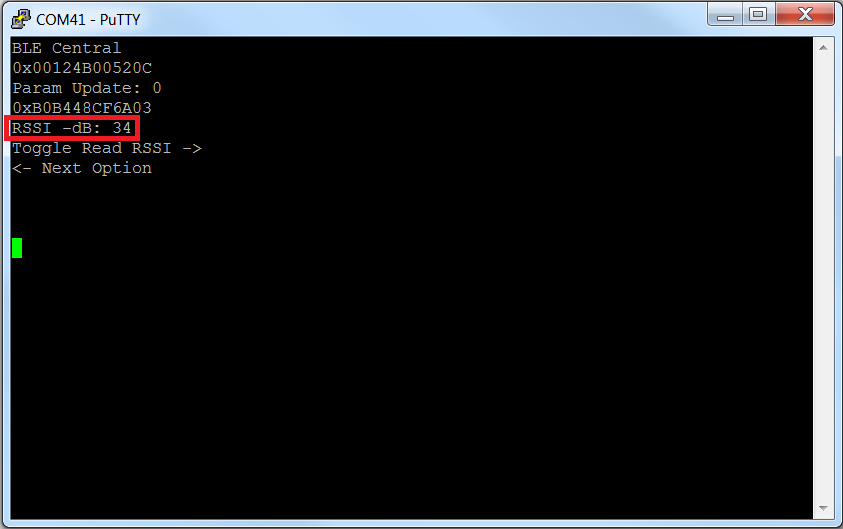
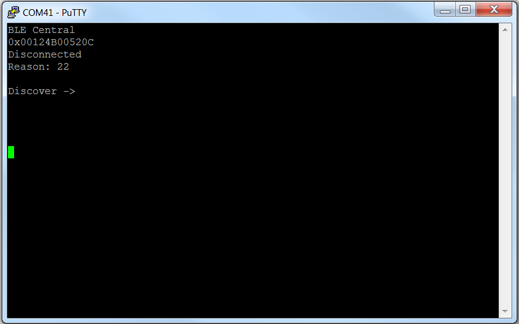

# Simple Central

## Table of Contents

* [Introduction](#Introduction)
* [Hardware Prerequisites](#Hardware Prerequisites)
* [Software Prerequisites](#Software Prerequisites)
* [Usage](#Usage)
    * [GATT Read/Write](#read/write)
    * [Toggle Read RSSI](#RSSI)
    * [Connection Update](#connection update)
    * [Disconnect](#disconnect)

## Introduction

The simple\_central project implements a simple Bluetooth low energy
central device with GATT client functionality. This project can be run
on various platforms, including the CC2640R2 Launchpad. By default, the
simple\_central application is configured to filter and connect to peripheral
devices with the TI Simple Profile UUID. To modify this behavior, set
DEFAULT\_DEV\_DISC\_BY\_SVC\_UUID to FALSE in simple\_central.

## Hardware Prerequisites

The default Simple Central configuration uses the
[LAUNCHXL-CC2640R2](http://www.ti.com/tool/launchxl-cc2640r2). This hardware
configuration is shown in the below image:

For custom hardware, see the [**Running the SDK on Custom Boards section of the
BLE5-Stack User's Guide**](http://software-dl.ti.com/lprf/ble5stack-docs-latest/docs/ble5stack/ble_user_guide/html/ble-stack/index.html#running-the-sdk-on-custom-boards).

## Software Prerequisites

For information on what versions of Code Composer Studio and IAR Embedded
Workbench to use, see the Release Notes located in the
docs/ble5stack folder. For
information on how to import this project into your IDE workspace and
build/run, please refer to [**The CC2640R2F Platform section in the BLE5-Stack User's Guide**](http://software-dl.ti.com/lprf/ble5stack-docs-latest/docs/ble5stack/ble_user_guide/html/cc2640/platform.html).

## Usage

This application uses the UART peripheral to provide an interface for the
application. This document will use PuTTY to serve as the display for the output
of the CC2640R2 LaunchPad. Note that any other serial terminal can be used. The
following default parameters are used for the UART peripheral for display:

  UART Param     |Default Values
  -------------- |----------------
  Baud Rate      |115200
  Data length    |8 bits
  Parity         |None
  Stop bits      |1 bit
  Flow Control   |None

Once the Simple Central sample application starts, the output to the terminal
will report its address and the fact that it is initialized and ready to begin
discovery, as shown below:

As shown, the right button (BTN-2 on the CC2640R2 LaunchPad) can be pressed to
begin discovering devices that are broadcasting BLE advertisements. This will
report the number of discovered devices:

The left button (BTN-1) can be pressed to go through the available devices. When
you have found the device that you are trying to connect to, press the right
button to connect. This will display information such as the MTU size and the
address of the connected peripheral device, as well as the first of a list of
options:

The red box shows the first of 4 options, which will be described in the
following sections:

* GATT Read/Write
* Toggle Read RSSI
* Connection Update
* Disconnect

These options can be selected by pressing the right button.

### Option: GATT Read/Write

This option is used to send read requests to the peripheral device and to write
new values to the device. Pressing the right button once will send a read
request to the peripheral device and will print the returned value:

Pressing it a second time will write a new value to the characteristic:

Pressing the button additional times will continue to alternate between reads
and writes. Each time a write is sent, it increments the value by 1. Note that
this option requires that the device has the TI Simple Profile UUID.

### Option: Toggle Read RSSI

This option is used to get the RSSI (signal strength) of the connected
peripheral device. Pressing the right button will toggle RSSI reads on and off.
When it is on, the RSSI value will be printed. The value will continue to be
updated as the RSSI changes:

### Option: Connection Update

This option updates the connection parameters. These values can be set by
changing the following constants in simple_central.c:
* DEFAULT_UPDATE_MIN_CONN_INTERVAL
* DEFAULT_UPDATE_MAX_CONN_INTERVAL
* DEFAULT_UPDATE_SLAVE_LATENCY
* DEFAULT_UPDATE_CONN_TIMEOUT

The "Param Update" value indicates whether the connection parameters have been
updated successfully, with 0 indicating success. If, for example, you press the
right button a second time before the connection update has completed, you will
see the value 58 returned, indicating that the controller is busy.

### Option: Disconnect

This option will terminate the connection. The following shows a successful
disconnection:

Note that this application also supports MTU exchanges. This is done
automatically by the Simple Central device after a connection is formed with a
peripheral device. A larger MTU can be negotiated by changing MAX_PDU_SIZE. More
information on this can be found in the
[**Configuring for Larger MTU Values section of the BLE5-Stack User's Guide**](http://software-dl.ti.com/lprf/ble5stack-docs-latest/docs/ble5stack/ble_user_guide/html/ble-stack/l2cap.html#configuring-for-larger-mtu-values).
