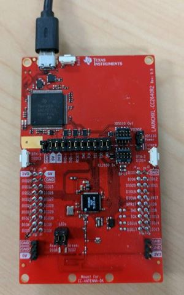

# simple_np (SNP)

* [Introduction](#Introduction)
* [Hardware Prerequisites](#Hardware Prerequisites)
* [Software Prerequisites](#Software Prerequisites)
* [SNP Functional Overview](#SNP Functional Overview)
    * [Architecture Overview](#Architecture Overview)
    * [Default GATT Services](#Default GATT Services)
    * [Limitations](#Limitations)
* [Compiling the SNP](#Compiling the SNP)
* [Unified Network Processor Interface](#Unified Network Processor Interface)
    * [BLE SNP Subsystem](#BLE SNP Subsystem)
    * [Example SNP BLE Subsystem NPI Frame](#Example SNP BLE Subsystem NPI Frame)
    * [Setting MRDY/SRDY Pins](#Setting MRDY/SRDY Pins)
* [Interfacing to the SNP](#Interfacing to the SNP)

## Introduction

The simple\_np project implements the TI Simple Network Processor Bluetooth low
energy device configuration. In this configuration, the CC2640R2 LaunchPad
operates as a Bluetooth low energy network processor incorporating the TI BLE Host
and Controller components of the protocol stack while the application and
profiles execute off-chip on an external MCU. The simple_np (SNP) is used in
designs that require adding Bluetooth low energy capability to an existing
embedded system with a host MCU or application processor.
[**The Software Developer's Guide**](http://software-dl.ti.com/lprf/ble5stack-docs-latest/docs/ble5stack/ble_user_guide/html/cc2640/index.html)
provides further details on the serial remote procedure call (RPC) interface to the SNP.

The supported serial transports are UART and SPI, which can be selected via build configurations.

This project uses stack and app configurations that are summarized in the table below:

App Build Configuration            | Compatible Stack Configuration  | Description
-----------------------------------|---------------------------------|-------------------------------------------------------------------
FlashROM\_StackLibrary (default)   | FlashROM\_Library               | Application build configuration linked to Stack library (fully executable) for UART transport
FlashROM\_SPI\_StackLibrary\_RCOSC | FlashROM\_Library               | Application build configuration linked to Stack library (fully executable) for SPI transport

FlashROM_Library configurations use the stack library configuration, which is
explained [**here**](http://software-dl.ti.com/lprf/ble5stack-docs-latest/docs/ble5stack/ble_user_guide/html/cc2640/architecture.html#stack-library-configuration-stack-library).

## Hardware Prerequisites

The default simple_np configuration uses the
[LAUNCHXL-CC2640R2](http://www.ti.com/tool/launchxl-cc2640r2). This hardware
configuration is shown in the below image:

For custom hardware, see the [**Running the SDK on Custom Boards section of the
BLE5-Stack User's Guide**](http://software-dl.ti.com/lprf/ble5stack-docs-latest/docs/ble5stack/ble_user_guide/html/ble-stack/index.html#running-the-sdk-on-custom-boards).

An additional device will also be needed to act as the application processor.

## Software Prerequisites

For information on what versions of Code Composer Studio and IAR Embedded
Workbench to use, see the Release Notes located in the
docs/ble5stack folder. For
information on how to import this project into your IDE workspace and
build/run, please refer to [**The CC2640R2F Platform section in the BLE5-Stack User's Guide**](http://software-dl.ti.com/lprf/ble5stack-docs-latest/docs/ble5stack/ble_user_guide/html/cc2640/platform.html).

## SNP Functional Overview

This section will provide an architectural overview of the simple_np.

### Architecture Overview

The SNP is a dual-device solution that requires an external MCU application
processor (AP) to control the CC2640R2F simple network processor. The SNP was
designed to simplify the complexity of the AP application by:

* Implementing as much BLE functionality as possible on the SNP, therefore
simplifying what the AP needs to do.
* Using a simple interface between the AP and the SNP.

Almost the entire BLE stack is implemented on the SNP. This is shown below:

As indicated above and described throughout this document, the AP (external
MCU) is responsible for the initial configuration of the GAP and GATT services.
It will also be notified of asynchronous events relating to these services, such
as connection establishments, attribute value updates, etc. Using the APIs
provided, the AP can then proceed accordingly after receiving these events.

The general procedure is:

1. Initialize GATT (add services, characteristics, CCCD’s, etc.).
2. Initialize GAP (advertisement data, connection parameters, etc.).
3. Advertise and optionally wait for a connection.
4. Respond to GATT requests and send notifications/indications as desired.

As shown in the figure above, TI-RTOS compatible processors can use the SAP
library to further simplify application processor development. The SAP library
is out of the scope of this document. More information and an example can be
found in the
[**MSP432 Bluetooth plugin document**](http://software-dl.ti.com/msp430/msp430_public_sw/mcu/msp430/simple_msp432_sdk_bluetooth_plugin/1_00_00_84/exports/docs/docs/users_guide_simplelink_msp432_sdk_plugin.html).

### Default GATT Services

In order to comply with the Bluetooth spec and communicate with central devices
such as mobile phones, there are two services which must be included in any BLE
device:

* Generic Access Service
* Device Information Service

Therefore, these services are included by default in the SNP and are managed by
the GATT server on the SNP. It is possible for the AP to modify and interact
with these services via the commands and events described in the BLE5-Stack User's Guide.

The figure below depicts how these services are initialized by default in the
SNP including what handle each attribute resides at. The Generic Access Service
is assigned the value 0x1800 and the Device Information Service is assigned
0x180A.

Any custom services and characteristics that the AP adds to the attribute table
will always be added after these initial two services. Any other services that
are added by the AP at run-time are managed by the AP. That is, the AP will
manage the characteristic value. It will be notified when a read/write of the
characteristic occurs and can respond (or not) with the value as it chooses.

### Limitations

The SNP will be configured by default to act only as a peripheral and/or
broadcaster device. This cannot be modified. This implies that the device can
only advertise and accept/reject connection. It cannot discover devices or
initiate a connection. Also, the SNP will only be configured as a GATT server;
it cannot be a GATT client. The standard use case is for the SNP (peripheral
GATT server) to connect to a central GATT client such as a smartphone.

Furthermore, while additional features will be added for future releases, the
following limitations currently exist:

* There is no NV storage available to the application.
* No direct advertisements.
* The maximum ATT_MTU_SIZE is 251 bytes
* ATT read multiple requests are not supported
* The SNP does not have the Generic Attribute service [6] defined in the
embedded project. If this is needed, it should be added and managed manually by
the AP. The Bluetooth low energy Software Developers Guide contains instructions
on adding the GATT service to your app
* L2CAP is not enabled. Therefore, connection-oriented-channel data transfer is
not possible.
* Only the Bluetooth 4.0 controller options are used: the Bluetooth 4.1 options
are disabled. Bluetooth 4.2 Host and Controller options are limited to Secure
Connections.
* User description attributes are read-only. They cannot be updated remotely by
the GATT client.
* Advertisements are always performed on all 3 advertisement channels.
* The advertiser’s address type is always static (no private or public address).
* Advertising filter policies have not been implemented.
* Since only one simultaneous connection is supported, all advertising during a
connection will be non-connectable.
* In order to change the type of an ongoing advertisement, it must be stopped
first.
* Services and characteristics are not stored in flash after they have been
added. Therefore, they will need to be re-initialized upon reset.
* Authenticated notifications and indications are not supported.

## Compiling the SNP

The BLE5-Stack ships pre-built hexfiles for the SNP in most common configurations.
These files can be found at `/examples/rtos/CC2640R2_LAUNCHXL/ble5stack/hexfiles`.

For the majority of users it is acceptable to use the SNP as a black box. Further
customizations can be made by building the project using IAR or CCS.

The SNP can be configured to support one of two serial interfaces: SPI and UART.
The interface can be selected by choosing the relevant project configuration in
the IDE. The FlashROM_StackLibrary configuration uses UART, and the
FlashROM_SPI_StackLibrary configuration uses SPI.

Furthermore, power management can be enabled/disabled by including/excluding the
POWER_SAVING preprocessor definition. This option will be described in more
detail in the Unified Network Processor Interface section.

## Unified Network Processor Interface

This section will describe TI's Unified Network Processor Interface (NPI). NPI
implements the serial link between the application and network processor, and it
supports UART or SPI. The
[**Unified NPI Wiki Page**](http://processors.wiki.ti.com/index.php/Unified_Network_Processor_Interface)
contains a full description of the protocol and its inner workings, and it is
highly recommended that the user read this page. Only NPI details specific to
the NPI BLE Subsystem are covered here.

### BLE SNP Subsystem

Unified NPI supports automatically routing messages from the serial port to
various software subsystems within the device. This allows the application and
network processor to easily exchange different types of messages on the same
serial bus without collision. Examples of subsystems include a peripheral
subsystem and a debug system. The SNP has its own subsystem. All commands and
APIs described in this document use the BLE SNP subsystem. A message’s subsystem
is set through its CMD0 field (described below).

The Unified NPI frame format is explained in detail at the Unified NPI Wiki
Page, but is copied here for simplicity in explaining the BLE SNP Subsystem.

SOF           | Length    | Cmd0                                         |Cmd1            | Data Payload | FCS
--------------|-----------|----------------------------------------------|----------------|--------------|--------
1 Byte (0xFE) | 2 bytes   | 1 byte (bits 5-7: type, bits 0-4: subsystem) | 1 Byte         | 0-4096 bytes | 1 Byte

#### SOF:

Start of Frame (1 byte). This byte must be 0xFE to indicate a start of
frame.

#### Length:

Length of the data payload field (2 bytes). This length does not
consider any other fields besides the data payload field. The largest acceptable
length is 4095. This field is little endian

#### Cmd0:

One byte split in 2 fields:

* Type (bits 5-7): type of message

Type           | Description
---------------|----------------------
0x01           | Synchronous Request
0x02           | Asynchronous Request
0x03           | Synchronous Response

* Subsystem (bits 0-4): The BLE SNP subsystem uses code 0x15 for all messages

More information about the type and subsystems can be found
[**here**](http://processors.wiki.ti.com/index.php/NPI_Type_SubSystem).

#### Cmd1:

opcode of the command / event (1 byte):

* Header(bits 6-7): Describes the BLE stack API group

Opcode Subgroup | Description
----------------|----------------------
0               | SNP Device Subgroup
1               | SNP GAP Subgroup
2               | SNP GATT Subgroup
3               | Reserved Subgroup

#### Payload:

The parameters of the command/event.

#### FCS:

Frame check sequence, calculated by an exclusive OR on all fields except SOF.

### Example SNP BLE Subsystem NPI Frame

The following table shows an example of the SNP Add Service (0x81) command to
send to SNP, with service type of primary service (0x01) and UUID 0xFFF0. The
SNP frame will be the following:

SOF     | Length    | Cmd0 |Cmd1   | Data Payload   | FCS
--------|-----------|------|-------|----------------|------
0xFE    | 0x03 0x00 | 0x35 | 0x81  | 0x01 0xF0 0xFF | 0xB9

Note that all multi-byte fields need to be in little endian format (except for
variable length data payload field where they are read in the order they arrive
on the bus).

### Setting MRDY/SRDY Pins

As described on the Unified NPI Wiki Page, MRDY and SRDY are configurable GPIO
pins. They can be changed and set by the application. The SNP task (simple_np.c)
sets these pins based on defines in the device’s board file. The table below
shows the defaults for the projects within the SDK. See the Unified NPI wiki
page for an example of how to change these pins.

The following table shows the default pins for serial communication:

PIN          | CC2640R2F Pins
-------------|----------------
MRDY         | IOID_23
SRDY         | IOID_12
UART_RX      | IOID_2
UART_TX      | IOID_3
SPI_MISO     | IOID_8
SPI_MOSI     | IOID_9
SPI_CLK      | IOID_10

## Interfacing to the SNP

The SNP can be interfaced to using serial commands. The MSP432 document
described in the [Architecture Overview](#Architecture Overview)
section is one example of the Simple Application Processor communicating with
the SNP.

The commands that can be used in this serial interface are detailed in
the [**SNP API References section of the BLE5-Stack User's Guide**](http://software-dl.ti.com/lprf/ble5stack-docs-latest/docs/ble5stack/ble_user_guide/html/cc2640/ble-sdg/api-reference.html)

See the message sequence chart below for a sample initialization of the SNP.

**Note: The chart below uses general terms to describe the payloads sent over the wire, these commands can be found in detail in the API reference above**

