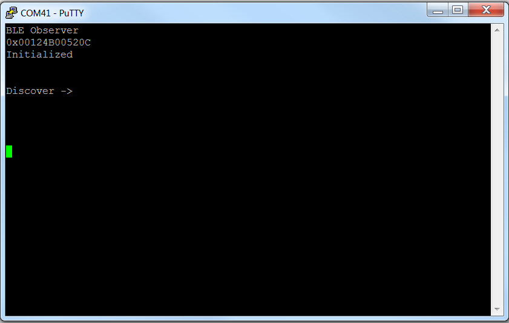
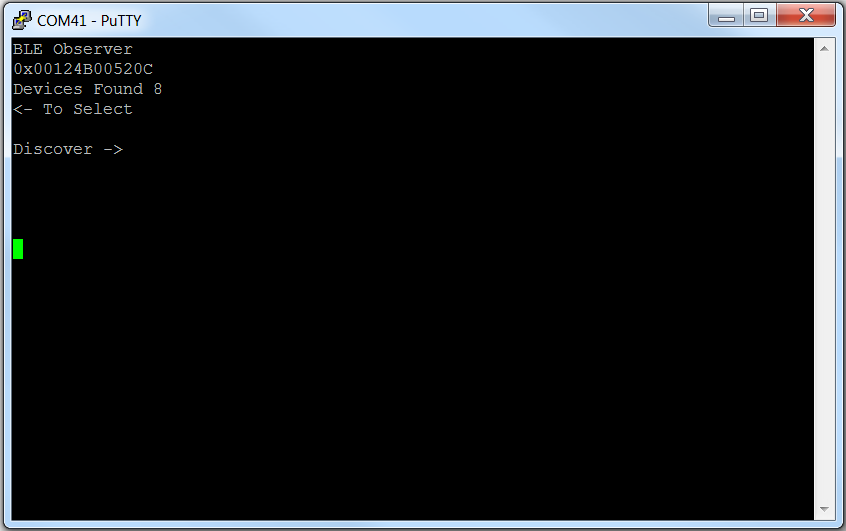
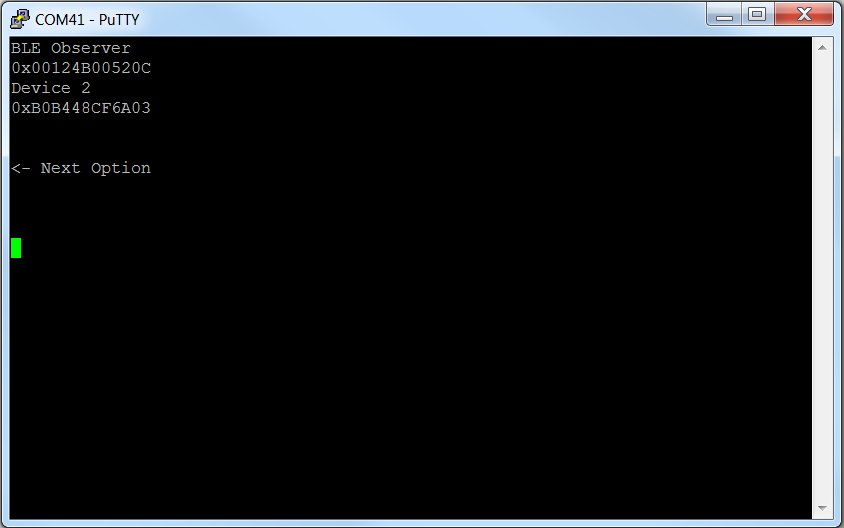

# Simple Observer

## Table of Contents

* [Introduction](#Introduction)
* [Hardware Prerequisites](#Hardware Prerequisites)
* [Software Prerequisites](#Software Prerequisites)
* [Usage](#Usage)

## Introduction

The simple\_observer project supports discovery (scanning)
functionality. The project also provides an interface to start/stop
scanning and display the discovered devices.

## Hardware Prerequisites

The default Simple Observer configuration uses the
[LAUNCHXL-CC2640R2](http://www.ti.com/tool/launchxl-cc2640r2). This hardware
configuration is shown in the below image:

For custom hardware, see the [**Running the SDK on Custom Boards section of the
BLE5-Stack User's Guide**](http://software-dl.ti.com/lprf/ble5stack-docs-latest/docs/ble5stack/ble_user_guide/html/ble-stack/index.html#running-the-sdk-on-custom-boards).

## Software Prerequisites

For information on what versions of Code Composer Studio and IAR Embedded
Workbench to use, see the Release Notes located in the
docs/ble5stack folder. For
information on how to import this project into your IDE workspace and
build/run, please refer to [**The CC2640R2F Platform section in the BLE5-Stack User's Guide**](http://software-dl.ti.com/lprf/ble5stack-docs-latest/docs/ble5stack/ble_user_guide/html/cc2640/platform.html).

## Usage

This application uses the UART peripheral to display messages and
interact with buttons. This document will use PuTTY to serve as the display for
the output of the CC2640R2 LaunchPad. Note that any other serial terminal can be
used. The following default parameters are used for the UART peripheral for
display:

  UART Param     |Default Values
  -------------- |----------------
  Baud Rate      |115200
  Data length    |8 bits
  Parity         |None
  Stop bits      |1 bit
  Flow Control   |None

Once the Simple Observer sample application starts, the output to the terminal
will report its address and the fact that it is initialized and ready to begin
discovery, as shown below:

Pressing the right button (BTN-2 on the CC2640R2 LaunchPad) will begin discovery
and will print the number of discovered devices:

The left button (BTN-1) can then be used to cycle through  the list of devices.
It will print the address of each device:

Because this is an observer device, and not a central, no connection with the
discovered devices can be formed.
