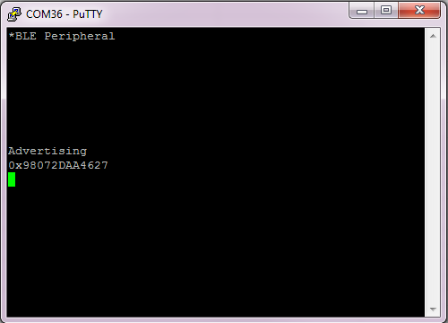

# Simple Peripheral

## Table of Contents

* [Introduction](#Introduction)
* [Hardware Prerequisites](#Hardware Prerequisites)
* [Software Prerequisites](#Software Prerequisites)
* [Service/Profile Table](#Service/Profile Table)
* [Usage](#Usage)
    * [Characteristic 1 (UUID: FFF1)](#char1)
    * [Characteristic 2 (UUID: FFF2)](#char2)
    * [Characteristic 3 (UUID: FFF3)](#char3)
    * [Characteristic 4 (UUID: FFF4)](#char4)
    * [Characteristic 5 (UUID: FFF5)](#char5)

## Introduction

The simple\_peripheral project implements a simple Bluetooth low energy
peripheral device with GATT services and demonstrates the TI Simple
Profile. This project can be a framework for developing many different
peripheral-role applications. The Simple Peripheral project is used as the
baseline for explaining the stack in the
[**BLE5-Stack User's Guide**](http://software-dl.ti.com/lprf/ble5stack-docs-latest/docs/ble5stack/ble_user_guide/html/cc2640/index.html).

This project uses stack and app configurations that are summarized in the table below:

App Build Configuration         | Compatible Stack Configuration | Description
--------------------------------|--------------------------------|-------------------------------------------------------------------
FlashROM_StackLibrary (default) | FlashROM_Library               | Application build configuration linked to Stack library (fully executable)
FlashROM_StackLibrary_RCOSC     | FlashROM_Library               | Application build configuration linked to Stack library for 32-kHz crystal-less device configuration

FlashROM_Library configurations use the stack library configuration, which is
explained [**here**](http://software-dl.ti.com/lprf/ble5stack-docs-latest/docs/ble5stack/ble_user_guide/html/cc2640/architecture.html#stack-library-configuration-stack-library).

This document discusses the procedure for using the Simple Peripheral
application when the FlashROM or FlashROM_StackLibrary configurations are used.
The FlashROM_OAD_ImgB and FlashROM_OAD_Offchip configurations are discussed in
the [**OAD section of the BLE5-Stack User's Guide**](http://software-dl.ti.com/lprf/ble5stack-docs-latest/docs/ble5stack/ble_user_guide/html/oad/oad.html)
and the FlashROM_StackLibrary_RCOSC configuration is discussed in the
[**RCOSC section of the BLE5-Stack
User's Guide**](http://software-dl.ti.com/lprf/ble5stack-docs-latest/docs/ble5stack/ble_user_guide/html/ble-stack/custom-hardware.html#using-32-khz-crystal-less-mode).

## Hardware Prerequisites

The default Simple Peripheral configuration uses the
[LAUNCHXL-CC2640R2](http://www.ti.com/tool/launchxl-cc2640r2). This hardware
configuration is shown in the below image:

For custom hardware, see the [**Running the SDK on Custom Boards section of the
BLE5-Stack User's Guide**](http://software-dl.ti.com/lprf/ble5stack-docs-latest/docs/ble5stack/ble_user_guide/html/ble-stack/index.html#running-the-sdk-on-custom-boards).

## Software Prerequisites

For information on what versions of Code Composer Studio and IAR Embedded
Workbench to use, see the Release Notes located in the
docs/ble5stack folder. For
information on how to import this project into your IDE workspace and
build/run, please refer to [**The CC2640R2F Platform section in the BLE5-Stack User's Guide**](http://software-dl.ti.com/lprf/ble5stack-docs-latest/docs/ble5stack/ble_user_guide/html/cc2640/platform.html).

## Service/Profile Table

This project contains 1 service, which has 5 characteristics.

Note that BLE Scanner may report 128 bit UUIDs, but the project is generating
16 bit UUIDs.

Characterisitic | UUID | Format         | Properties | Profile Source
----------------|------|----------------|------------|-----------------------------------
1               | FFF1 | 1 Byte Integer | Read/Write | peripheral.c/simple_gatt_profile.c
2               | FFF2 | 1 Byte Integer | Read       | peripheral.c/simple_gatt_profile.c
3               | FFF3 | 1 Byte Integer | Write      | peripheral.c/simple_gatt_profile.c
4               | FFF4 | 1 Byte Integer | Notify     | peripheral.c/simple_gatt_profile.c
5               | FFF5 | 5 Byte Integer | Read       | peripheral.c/simple_gatt_profile.c

## Usage

This application uses the UART peripheral to provide an
interface for the application. The UART is only used for display
messages.

This document will use PuTTY to serve as the display for the output of the
CC2640R2 LaunchPad, and it will use BLE Scanner as the phone app that will act
as the central device that will connect to the Simple Peripheral device. Note
that any other serial terminal and smart phone BLE application can be used. The
following default parameters are used for the UART peripheral for display:

  UART Param     |Default Values
  -------------- |----------------
  Baud Rate      |115200
  Data length    |8 bits
  Parity         |None
  Stop bits      |1 bit
  Flow Control   |None

Once the Simple Peripheral sample application starts, the output to the terminal
will report it's address and the fact that it is advertising, as shown below:

Advertising is enabled by default upon startup, so there is no need to
physically press a button to start advertising. Using BLE Scanner to scan for the
device, you should see a device with the name of SimpleBLEPeripheral (note that
the navigation might be slightly different depending on your mobile
application):

If there is more than 1 device called SimpleBLEPeripheral, the RSSI value in the
colored circles on the left can be used to find which device you are trying to
connect to. Press the "connect" button to connect to the device. Once connected,
the terminal window will show the address of the connected device (smartphone):

After a connection is formed, you will also have the option to switch which physical
layer (PHY) preference is used. For more information on the differences between
the PHY options, see [**LE 2M PHY section of the BLE5-Stack User's Guide**](http://software-dl.ti.com/lprf/ble5stack-docs-latest/docs/ble5stack/ble_user_guide/html/ble-stack/phy-2mbps.html).

In BLE Scanner, you should be able to see various information about the Simple
Peripheral device:

You should see 1 service, which is labeled as "CUSTOM SERVICE" (this may be
slightly different for other smartphone applications). It will also provide its
UUID. Clicking on this service will display the 5 characteristics that it
contains, with information about each characteristic:

Scrolling down should show all 5 characteristics. The following sections detail
the functions and operations of each of the characteristics.

### Characteristic 1 (UUID: FFF1)

This characteristic demonstrates both read and write properties, and it contains
a 1-byte-long value. As shown below, there are 2 circles, one with an "R" and
one with a "W", next to "CUSTOM CHARACTERISTIC":

These are the buttons used for read and write operations. The value for this
characteristic is set to "01" by default, and it can be changed by pressing the
write button. Upon pressing the write button, you will see the following menu:

To write a new byte value to it, click on "Text" to change it to "Byte Array",
and then enter the value that you want to write to the characteristic (in
hexadecimal) in the field below. Press ok, and then you will be able to see that
the value has changed by looking at the terminal window. The example below shows
a write of 0x42:

Note that the terminal window will print the value in decimal. The value will
also be updated in BLE Scanner:

The read button can be used to read a value. If the Simple Peripheral device has
changed the value of the characteristic (i.e. by using a button press), then
pressing the read button will show the updated value in BLE scanner as shown
above.

There is also a circle with an "R" next to "Characteristic User Description".
Pressing this will show the name of the characteristic, as shown below:

### Characteristic 2 (UUID: FFF2)

This characteristic has read property only. Its value can be read following
the same procedure as is detailed for characteristic 1. It has a default value
of 0x02.

### Characteristic 3 (UUID: FFF3)

This characteristic has write property only. Its value can be written to
following the same procedure as is detailed for characteristic 1. It has a
default value of 0x03.

### Characteristic 4 (UUID: FFF4)

This characteristic has notify property only. It is a single byte, and it is set
to whatever value is contained in characteristic 3 (this value can be changed by
writing to characteristic 3). Next to "CUSTOM CHARACTERISTIC" there is a circle
with an "N". Pressing this button will enable notifications, and this
characteristic will be updated and will display the value contained in
characteristic 3:

Before pressing the notify button, the read button next to "Client
Characteristic Configuration" can be pressed to show whether notifications (or
indications) have been enabled:

Once notifications have been enabled, this will be displayed:

### Characteristic 5 (UUID: FFF5)

This characteristic has read property only. It is 5 bytes, and its default value
is 0x0102030405. It differs from the other characteristics in that it requires
authentication. This is done by pairing the smartphone with the Simple
Peripheral device. The process of doing this varies depending on the smartphone
application and the operating system that is being used. Please see
documentation on the operating system that you are using for more details. Some
documentation for iOS can be found
[**here**](https://support.apple.com/en-us/HT204091), and some for android can
be found [**here**](https://support.google.com/nexus/answer/2819579?hl=en). If
the Simple Peripheral device and the smartphone have not been paired, you will
not see anything when you press the read button (this includes reading the
characteristic user description). Once the devices are paired, pressing the read
button will show the characteristic's value as shown below:

