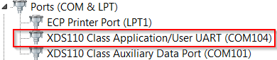
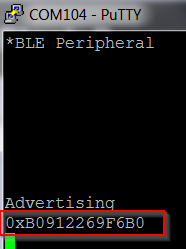
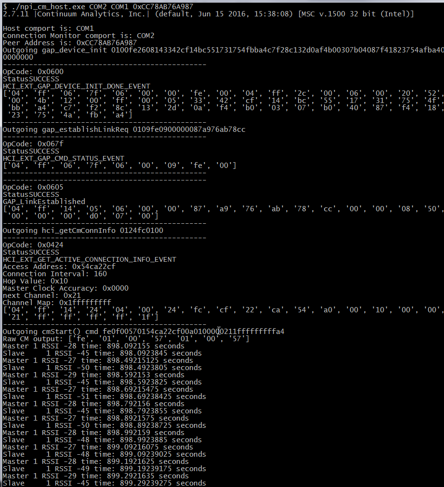
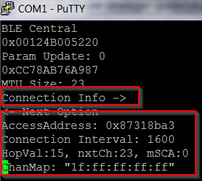
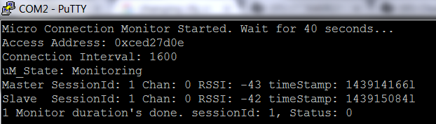

# Connection Monitor (CM) Examples Guide

## Table of Contents

* [Introduction](#Introduction)
* [Hardware Prerequisites](#Hardware Prerequisites)
* [Software Prerequisites](#Software Prerequisites)
* [Usage](#Usage)
    * [uNPI_CM_FlashOnly_MultiMode](#uNPI_CM_FlashOnly_MultiMode)
    * [CM_FlashOnly_MultiMode](#CM_FlashOnly_MultiMode)

## <a name="Introduction"></a>Introduction
The Connection Monitor (CM) projects showcase how to utilize the
TI Micro BLE Stack as the connection monitor role.
For more information on the TI Micro BLE Stack see
[**BLE-Stack User's Guide for Bluetooth 4.2**](../../../../../docs/blestack/ble_user_guide/html/u-stack/index.html).

There are two projects/configurations:

App Build Configuration     | Description
----------------------------|---------------------------------------------------------------------------------------------------
CM_FlashOnly_MultiMode      | Base application showing how to use Micro BLE Stack in the Connection Monitor Role
uNPI_CM_FlashOnly_MultiMode | Same as the CM_FlashOnly_MultiMode project, with unified NPI built in to receive data from a host

## <a name="Hardware Prerequisites"></a>Hardware Prerequisites

Both CM\_FlashOnly\_MultiMode and uNPI\_CM\_FlashOnly\_MultiMode is designed to use
[LAUNCHXL-CC2640R2](http://www.ti.com/tool/launchxl-cc2640r2).

2 additional [LAUNCHXL-CC2640R2](http://www.ti.com/tool/launchxl-cc2640r2) will be
required to create a connection to monitor. One of these launchpads will be running
host\_test or simple_central to act as a central, thus will need a computer capable of running BTool.
Another launchpad will be flashed with simple\_peripheral to act as a peripheral for
host\_test to connect to. This can be replaced with another peripheral, such as a phone.

* Two [LAUNCHXL-CC2640R2](http://www.ti.com/tool/launchxl-cc2640r2) is required.
* One Computer able to utilize BTool and Serial Ports is required.
* One Peripheral is required. (Or an additional [LAUNCHXL-CC2640R2](http://www.ti.com/tool/launchxl-cc2640r2))

## <a name="Software Prerequisites"></a>Software Prerequisites

For information on what versions of Code Composer Studio and IAR Embedded
Workbench to use, see the Release Notes located in the docs/blestack folder. For
information on how to import this project into your IDE workspace and
build/run, please refer to [**The CC2640R2F Platform section in the
BLE-Stack User's Guide for Bluetooth 4.2**](../../../../../docs/blestack/ble_user_guide/html/cc2640/platform.html).

In order to utilize 'npi_cm_host.py' for the uNPI\_CM\_FlashOnly\_MultiMode configuration
you will need a valid installation of
* [Python 2.7](https://www.python.org/download/releases/2.7/)

### Required Python Modules
The 'npi_cm_host.py' script utilizes modules that need to be installed
* [pyserial](https://pythonhosted.org/pyserial/)

The 'requirements.txt' contains a list of the modules required; can be used with
```bash
pip install -r requirements.txt
```
'requirements.txt' and 'npi_cm_host.py' are located in
```bash
/tools/blestack/connection_monitor/
```

## <a name="Usage"></a>Usage

# <a name="uNPI_CM_FlashOnly_MultiMode"></a>Setup and User Guide For uNPI_CM_FlashOnly_MultiMode

### Set Up

The uNPI\_CM\_FlashOnly\_MultiMode project utilizes the UART peripheral
through unified NPI. This requires the computer to be connected to the
launchpad through the USB debugging interface. Flash uNPI\_CM\_FlashOnly\_MultiMode
project onto a launchpad and connect it the computer.

Flash another launchpad with the host\_test project, connect this launchpad
to the computer and launch BTool. Instructions can be found in [**Host Test Guide**](../host_test/readme.html)
and [**BTool**](../../../../../docs/blestack/btool_user_guide/index.html).

Each launchpad connected to the computer will enumerate as 2 COM ports. Always
use the port labeled as "XDS110 Class Application/User UART", this interfaces
Application UART.



Take note of which COM port belongs to the launchpad running uNPI\_CM\_FlashOnly\_MultiMode
and which COM port belongs to the launchpad running host\_test.

Optionally, if using a third launchpad as a peripheral - flash the final launchpad
with simple\_peripheral.
After flashing is completed, record the Bluetooth Device Address. This can be found
in the UART terminal. Once the Bluetooth Device Address is noted the launchpad
is only required to be powered, no need to connect to the computer through the debugger.



### Running the Script Manually with No Arguments

Some modifications to 'npi_cm_host.py' are required prior to running the project.
These modifications are to configure the script to control the correct devices and
connect host\_test to the right peripheral.

1. Update 'host_port' with the COM Port of the launchpad running host\_test.
2. Update 'cm_port' with the COM Port of the launchpad running uNPI\_CM\_FlashOnly\_MultiMode.
3. Update 'strPeerAddress' with the Bluetooth Device Address of the peripheral to be connected to.
4. Run the script using Python. This requires calling the python executable with
the path to 'npi_cm_host.py' passed in as an argument.

```python
if __name__ == '__main__':
    global peerAddrs
    version_control()
    rtn_args = parse_args()

if(len(sys.argv) < 4):
    print '\nUsing Default Hardcoded Values: '
    print 'or enter 3 default(cm_port host_port peerAddress) arguments.'
    print 'See -h help.\n'
    #set your own hard coded com ports
    host_port = 'COM104'
    cm_port     = 'COM105'
    strPeerAddress = '0xB0912265CBE2'
```
```bash
C:\Python27\python.exe [sdk]\tools\blestack\connection_monitor\npi_cm_host.py
```
Note 'sdk' refers to the Software Development Kit installation directory.

The script will send commands to the launchpad running host\_test to act as a
central device and connect to the peripheral. Then it will query the central for
the current connection parameters. Finally it will launch the connection monitor
with the retrieved connection parameters. A continues stream of RSSI data and timestamps
from the connection monitor of master and slave devices at each connection event will
appear in the terminal after a short delay.
The default connection interval of connection events is 100ms.

<PICTURE OF THE sTREAM>

### Running the Python Script or Executable with Command Line arguments

To run the script without editing the python code, the configuration information can be
passed into the script as arguments. A executable is also provided, allow the user to
utilize uNPI\_CM\_FlashOnly\_MultiMode project without having Python installed. Similar
to the python script, arguments need to passed in when being invoked.

The arguments are expected to be in the following order:

Argument 1          | Argument 2           | Argument 3
------------------- | -------------------- | ----------------------------
CM COM PORT         |  host_test COM PORT  | Peripheral Bluetooth Address


```command
[sdk]\tools\blestack\connection_monitor\npi_cm_host.exe COM4 COM5 0xB0912265CBE2
```

Or alternatively the same command line will also work with a direct call to the python script.

```command
C:\Python27\python.exe [sdk]\tools\blestack\connection_monitor\npi_cm_host.py COM4 COM5 0xB0912265CBE2
```
Note 'sdk' refers to the Software Development Kit installation directory.

The script will send commands to the launchpad running host\_test to act as a
central device and connect to the peripheral. Then it will query the central for
the current connection parameters. Finally it will launch the connection monitor
with the retrieved connection parameters. A continues stream of RSSI data and timestamps
from the connection monitor of master and slave devices at each connection event will
appear in the terminal after a short delay.
The default connection interval of connection events is 100ms.



### Additional Information

The script 'npi_cm_host.py' contains in-line comments - these comments
describe script behavior.

# <a name="CM_FlashOnly_MultiMode"></a>Setup and User Guide For CM\_FlashOnly\_MultiMode

### Set Up

CM\_FlashOnly\_MultiMode does not utilize unified NPI, thus has no
transport layer interface to the UART Module. In order to configure
the connection monitor, connection parameters must be manually
placed into application code and compiled. Connect a launchpad which
will be flashed with CM\_FlashOnly\_MultiMode to the computer. This will
be the Connection Monitor launchpad.

Another launchpad will be acting as a central device. Flash this launchpad
with simple_central and connect to it's COM Port using a serial terminal
emulator such as Putty. See [**Simple Central Guide**](../simple_central/readme.html)
for instructions on how to utilize and get the project working.

Optionally, if using a third launchpad as a peripheral - flash this final launchpad
with simple\_peripheral.
After flashing is completed, record the Bluetooth Device Address. This can be found
in the UART terminal. See [**Simple Peripheral Guide**](../simple_peripheral/readme.html)
Once the Bluetooth Device Address is noted, the launchpad
is only required to be powered, no need to connect to the computer through the debugger.

Form a connection between the simple_central and simple_peripheral
through the simple_central's two button interface. In other words,
scan for devices, and connect to the advertising simple_peripheral
by verifying the Bluetooth Device Address noted earlier.

Once a connection is formed, use the 'Connection Info' menu option
to extract the Connection Information required by the Connection Monitor.
Ensure that the connection is maintained.



Open the CM\_FlashOnly\_MultiMode project; in the 'micro_cm_demo.c'
source file, the 'MicroCmDemo_init' function, input the
Connection Information retrieved, such as the Access Address,
Connection Interval, and Hop Value.

```c
/* Initialize Connection Monitor */
if (ubCm_init() == true)
{
    /*
     * The ubCM_Start() is called here to kick off CM sessions as a demo.
     * This API should be called from host uNPI once the uNPI host
     * if available. The currentStartTime, access address, and scan duration
     * are hard-coded. They should be provided by the host. In this demo, the
     * very first ubCM_start() call will cover UB_MAX_MONITOR_DURATION.
     */
    ubCMConnInfo.ArrayOfConnInfo[0].accessAddr = 0x87318ba3;
    ubCMConnInfo.ArrayOfConnInfo[0].currentStartTime = 0;
    ubCMConnInfo.ArrayOfConnInfo[0].nextStartTime = RF_getCurrentTime() + 100 * BLE_TO_RAT;
    ubCMConnInfo.ArrayOfConnInfo[0].scanDuration = UB_MAX_MONITOR_DURATION; // 40.96s
    ubCMConnInfo.ArrayOfConnInfo[0].connInterval = 1600;
    ubCMConnInfo.ArrayOfConnInfo[0].hopValue = 15;
    ubCMConnInfo.ArrayOfConnInfo[0].combSCA = 90; // Master+Slave = 50+40
    ubCMConnInfo.ArrayOfConnInfo[0].chanMap[0] = 0xFF;
    ubCMConnInfo.ArrayOfConnInfo[0].chanMap[1] = 0xFF;
    ubCMConnInfo.ArrayOfConnInfo[0].chanMap[2] = 0xFF;
    ubCMConnInfo.ArrayOfConnInfo[0].chanMap[3] = 0xFF;
    ubCMConnInfo.ArrayOfConnInfo[0].chanMap[4] = 0x1F;
```
Build the project and flash the Connection Monitor launchpad
with the updated CM\_FlashOnly\_MultiMode project.

### Observing the Monitored Information

Open Putty on the computer, and connect to the
"XDS110 Class Application/User UART" COM Port that corresponds
to the Connection Monitor launchpad. After about 40 seconds
RSSI and timestamp information should appear as the Connection
Monitor launchpad following the connection between the central
and the peripheral.


