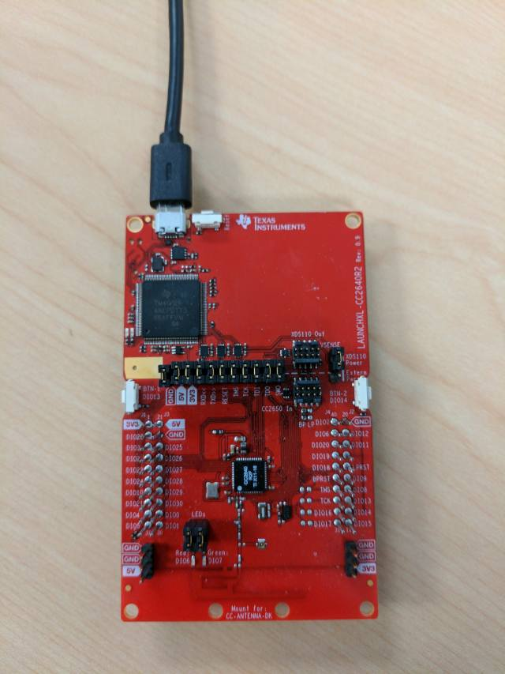

# Simple Peripheral OAD On-chip

## Table of Contents

* [Introduction](#Introduction)
* [Hardware Prerequisites](#Hardware Prerequisites)
* [Software Prerequisites](#Software Prerequisites)
* [Service/Profile Table](#Service/Profile Table)
* [Usage](#Usage)

## Introduction

The simple\_peripheral\_oad\_onchip project demonstrates on-chip OAD
functionality with the simple\_peripheral application. The application behavior
is the same as the stock [simple\_peripheral project](../simple_peripheral/README.html),
with the exception that OAD is added.

On-chip OAD employs a dual image architecture. This means that two images
share the same BLE-Stack. This project implements the user app
application in the OAD on-chip demo. The user app is intended to be the end application image.
The persistent app is also included in the project and is intended to be a
lightweight implementation of the OAD profile.

FlashROM configurations use the split image configuration, which is explained
[**here**](../../../../../docs/blestack/ble_user_guide/html/cc2640/architecture.html#split-image-configuration).
FlashROM/split image configurations are required by OAD on-chip where two applications
must share the same BLE-Stack.

**Note: This application implements the user app ``cc2640r2lp_app`` and includes the following
projects: The persistent app is implemented by ``cc2640r2lp_persistent_app`` along with the
stack image ``cc2640r2lp_stack`` shared with the user app.
Additionally you will have to load the ``cc2640r2lp_bim_onchip`` for the device to function properly.**

This document seeks to extend the [simple\_peripheral project](../simple_peripheral/README.html)
documentation that is already in place, and explain how simple\_peripheral can
be used to demonstrate on-chip OAD. For an advanced discussion of OAD, and
an in-depth explanation of this project, please see:

[** On-chip OAD User's Guide Section**](../../../../../docs/blestack/ble_user_guide/html/oad-ble-stack-3.x/oad_onchip.html)

## Hardware Prerequisites

The default Simple Peripheral OAD on-chip configuration uses the
[LAUNCHXL-CC2640R2](http://www.ti.com/tool/launchxl-cc2640r2). This hardware
configuration is shown in the below image:

For custom hardware, see the [**Running the SDK on Custom Boards section of the
BLE-Stack User's Guide for Bluetooth 4.2**](../../../../../docs/blestack/ble_user_guide/html/ble-stack-3.x/index.html#running-the-sdk-on-custom-boards).

## Software Prerequisites

For information on what versions of Code Composer Studio and IAR Embedded
Workbench to use, see the Release Notes located in the docs/blestack folder. For
information on how to import this project into your IDE workspace and
build/run, please refer to [**The CC2640R2F Platform section in the
BLE-Stack User's Guide for Bluetooth 4.2**](../../../../../docs/blestack/ble_user_guide/html/cc2640/platform.html).

## Service/Profile Table

This project contains the simple service, which has 5 characteristics.

Note that BLE Scanner may report 128 bit UUIDs, but the project is generating
16 bit UUIDs.

Characterisitic | UUID | Format         | Properties | Profile Source
----------------|------|----------------|------------|----------------------
1               | FFF1 | 1 Byte Integer | Read/Write | `simple_gatt_profile.c`
2               | FFF2 | 1 Byte Integer | Read       | `simple_gatt_profile.c`
3               | FFF3 | 1 Byte Integer | Write      | `simple_gatt_profile.c`
4               | FFF4 | 1 Byte Integer | Notify     | `simple_gatt_profile.c`
5               | FFF5 | 5 Byte Integer | Read       | `simple_gatt_profile.c`

Additionally this project contains the OAD Reset service, which has 1 characteristic.

See [** OAD Reset Service Description in the OAD User's Guide**](../../../../../docs/blestack/ble_user_guide/html/oad-ble-stack-3.x/oad_concepts.html#oad-reset-service-0xffd0)
for more information on the OAD service

## Usage

This application uses the UART peripheral to provide an
interface for the application. The UART is only used for display
messages.

This document will use PuTTY to serve as the display for the output of the
CC2640R2 LaunchPad, and it will use BLE Scanner as the phone app that will act
as the central device that will connect to the Simple Peripheral device. Note
that any other serial terminal and smart phone BLE application can be used. The
following default parameters are used for the UART peripheral for display:

  UART Param     |Default Values
  -------------- |----------------
  Baud Rate      |115200
  Data length    |8 bits
  Parity         |None
  Stop bits      |1 bit
  Flow Control   |None

For further guidance refer to [** On-chip OAD User's Guide Section**](../../../../../docs/blestack/ble_user_guide/html/oad-ble-stack-3.x/oad_onchip.html)

