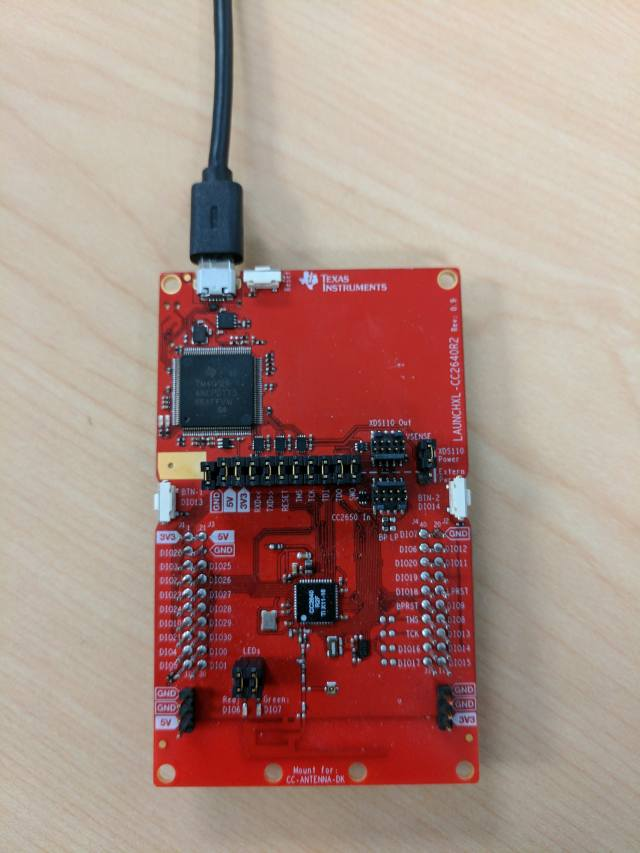

# Simple Peripheral Secure Firmware

## Table of Contents

* [Introduction](#Introduction)
* [Hardware Prerequisites](#Hardware Prerequisites)
* [Software Prerequisites](#Software Prerequisites)
* [Out of box demo](#Out of box demo)
* [Python Script Usage](#Python Script Usage)
    * [Secure Firmware Generation](#Secure Firmware Generation)
    * [PEM File Generation](#PEM File Generation)

## <a name="Introduction"></a>Introduction

The simple\_peripheral project implements a simple Bluetooth low energy
peripheral device with GATT services and demonstrates the TI Simple
Profile. This project can be a framework for developing many different
peripheral-role applications. The Simple Peripheral project is used as the
baseline for explaining the stack in the
[**BLE-Stack User's Guide for Bluetooth 4.2**](../../../../../docs/blestack/ble_user_guide/blestack-users-guide.html).

This project uses stack and app configurations that are summarized in the table below:

App Build Configuration     | Compatible Stack Configuration | Description
----------------------------|--------------------------------|-------------------------------------------------------------------
FlashROM_StackLibrary       | FlashROM_Library               | Application build configuration linked to Stack library (fully executable)

FlashROM_Library configurations use the stack library configuration, which is
explained [**here**](../../../../../docs/blestack/ble_user_guide/html/cc2640/platform.html#stack-library-configuration).

This document discusses the procedure for using secure firmware with the Simple Peripheral
application when the FlashROM_StackLibrary configurations are used.

## <a name="Hardware Prerequisites"></a>Hardware Prerequisites

The default Simple Peripheral configuration uses the
[LAUNCHXL-CC2640R2](http://www.ti.com/tool/launchxl-cc2640r2). This hardware
configuration is shown in the below image:



For custom hardware, see the [**Running the SDK on Custom Boards section of the
BLE-Stack User's Guide for Bluetooth 4.2**](../../../../../docs/blestack/ble_user_guide/html/ble-stack/index.html#running-the-sdk-on-custom-boards).

## <a name="Software Prerequisites"></a>Software Prerequisites

For information on what versions of Code Composer Studio and IAR Embedded
Workbench to use, see the Release Notes located in the docs/blestack folder. For
information on how to import this project into your IDE workspace and
build/run, please refer to [**The CC2640R2F Platform section in the
BLE-Stack User's Guide for Bluetooth 4.2**](../../../../../docs/blestack/ble_user_guide/html/cc2640/platform.html).

The following projects/scripts from the SDK are used for the secure firmware demo:

  * secure_fw (examples/rtos/CC2640R2_LAUNCHXL/blestack/secure_fw)
  * simple_peripheral_secure_fw  ( examples/rtos/CC2640R2_LAUNCHXL/blestack/simple_peripheral_secure_fw)
  * secure_fw_tool.py  (tools/blestack/secure_fw) ( Please refer to [Secure Firmware Generation](#Secure Firmware Generation) for usage instructions)
  * Python ECDSA library if not already installed (using Python v2.7.11)

## <a name="Out of box demo"></a>Out of box demo

1. Build simple_peripheral_secure_fw to generate the application .bin file.
1. Either copy private key file in PEM format to the folder where the secure_fw_tool.py
exists or provide path to private key file using the handle -p in the arguments for the
secure_fw_tool.py to generate secure bin file. See [PEM File Generation](#PEM File Generation) for more info.
1. Use secure_fw_tool.py with the path to the above generated .bin file
(see instructions in [Secure Firmware Generation](#Secure Firmware Generation)) to generate the secure bin file.
(ble_simple_peripheral_secure_fw_cc2640r2lp_app.bin is the name of the .bin file generated on running the script out of the box)
1. Flash the secure bin file to the device using SmartRF Flash Programmer 2 at address 0x00000000.
1. Build secure_fw and program to device using SmartRF Flash Programmer 2 at address 0x0001F000.
1. If verification is successful, device behaves similar to the simple_peripheral project
with an additional "Image Verified" printed on the UART display on startup as shown below:<br>

1. If verification is unsuccessful, view the error code for the reason of the failure.
  * If SECURE_FW_ERASE_FLASH is set to true in secure_fw project, upon failure to verify secure header, the entire image firmware is erased and the error to page 1 at address 0x00001000.
  * If SECURE_FW_ERASE_FLASH is set to false in secure_fw project, error code can be determined in the value of the variable "errorCode" in secure_fw_main.c using the debugger.

By default, SECURE_FW_ERASE_FLASH is set to false.
The description of the error codes is listed below:

Code   | Error reason                                                      |
-------|-------------------------------------------------------------------|
0x01   | Invalid magic word                                                |
0x02   | Invalid firmware version (Currently not supported)                |
0x03   | Invalid start/end address                                         |
0x04   | Invalid length                                                    |
0x05   | Cert element not found                                            |
0x06   | Verification failed                                               |
0x07   | Self-verification failed (This feature is not supported currently)|

## <a name="Python Script Usage"></a>Python Script Usage
The SDK includes a script(secure_fw_tool.py) for generating the metadata required for the secure image.
The user may also create another script to generate the private key as described in [PEM File Generation](#PEM File Generation).

### <a name="Secure Firmware Generation"></a>Secure Firmware Generation
Usage: secure_fw_tool.py [-h] [-s STARTADDR] [-m MAGICWORD] [-b SECUREBIN] Inbin privateKey endAddr

Argument         | Description                                                           |
-----------------|-----------------------------------------------------------------------|
Inbin            | Path to input application image in .bin format                        |
privateKey       | Private key file in .pem format (see [PEM File Generation](#PEM File Generation))|
endAddr          | End address of firmware                                               |
-h               | Show this help message and exit                                       |
-s [STARTADDR]   | Start address of firmware                                             |
-m [MAGICWORD]   | Magic word to identify start of image metadata                        |
-b [SECUREBIN]   | Path to save secure bin file                                          |

Example: python secure_fw_tool.py < input bin file > < path to private key file in .pem format > < end address from map file >
python secure_fw_tool.py ble_simple_peripheral_secure_fw_cc2640r2lp_app_FlashROM_StackLibrary.bin private.pem 0000fc44

where the end address points to an image from simple_peripheral_secure_fw project.
The example above will use default parameters for rest of the optional arguments.
Default values used out of the box for secure_fw_tool.py:
  * Private key : 139847857b5301c29a51bb8ef4aa259a99ed4b826400505c050b46ca78db560f
  * Start address : 0x00000070
  * End address : 0x0000ed24(CCS) 0x0000fc44(IAR)
  * Length of image : 0x00017F90
  * Magic Word : 574653204C42530A
  * Secure bin file name: ble_simple_peripheral_secure_fw_cc2640r2lp_app.bin

End of firmware address points to the last address used by the firmware image.
The end address can be determined from the simple_peripheral_secure_fw project map file as follows:
  * CCS : End address is the address pointed by the symbol __TI_CINIT_Limit
  * IAR : End address is two subtracted from the last address pointed by "Initializer bytes" before "A1": SNVSECT section

### <a name="PEM File Generation"></a>PEM File Generation

The following python code can be used to generate the private key in PEM file format that is needed by the secure_fw_tool.py script:
```python
from ecdsa import NIST256p
from ecdsa import SigningKey
import binascii
import array

pk = '\x13\x98\x47\x85\x7b\x53\x01\xc2\x9a\x51\xbb\x8e\xf4\xaa\x25\x9a\x99\xed\x4b\x82\x64\x00\x50\x5c\x05\x0b\x46\xca\x78\xdb\x56\x0f'
sk = SigningKey.from_string(pk,curve=NIST256p)
open("private.pem","w").write(sk.to_pem())
vk = sk.get_verifying_key()
print " Public Key " , binascii.hexlify(vk.to_string())
```

